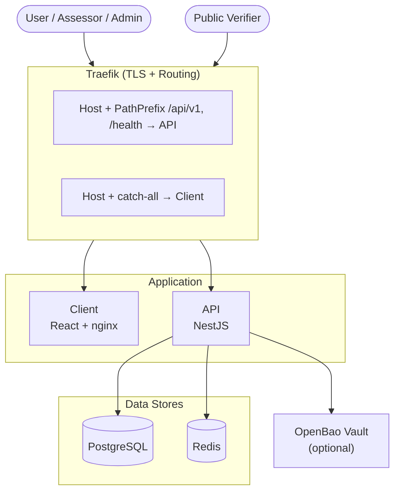
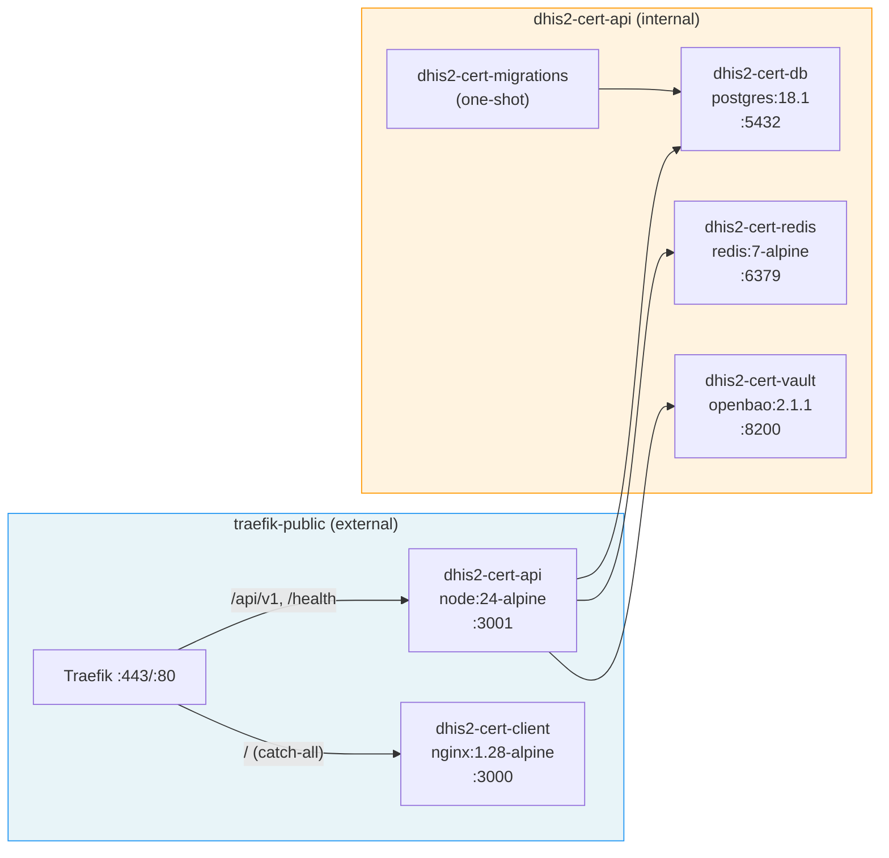
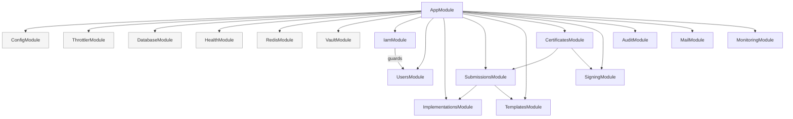
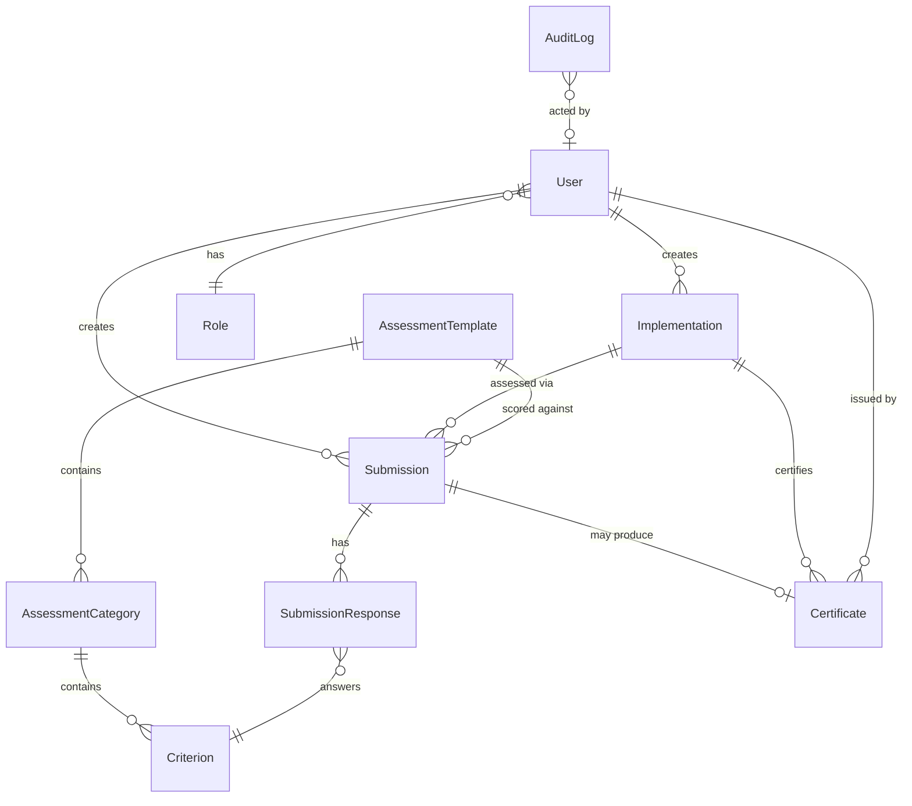
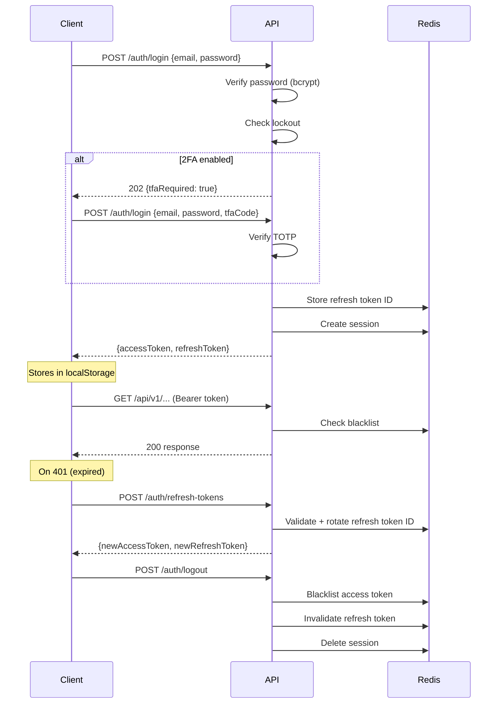
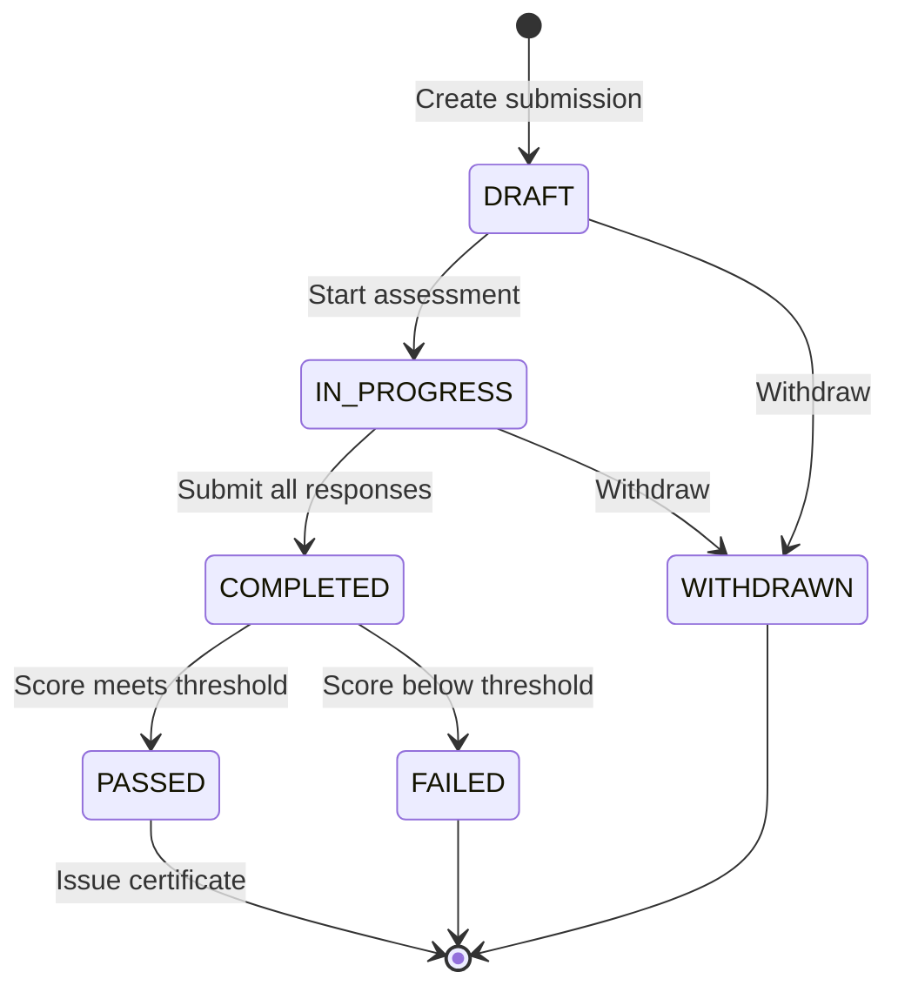
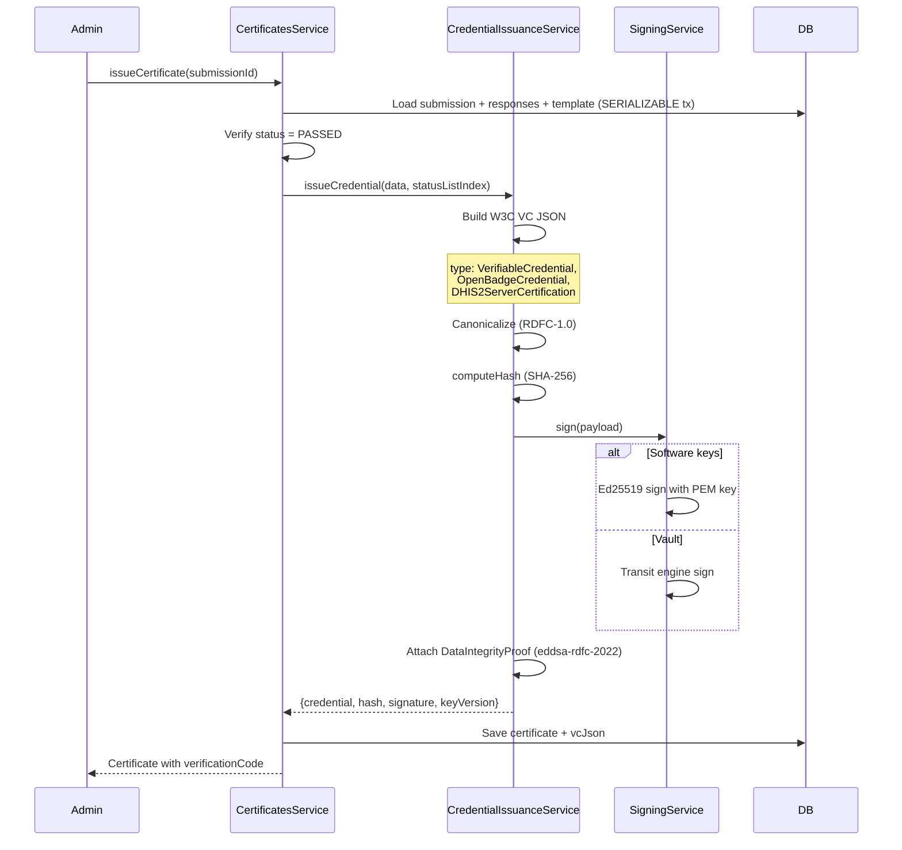
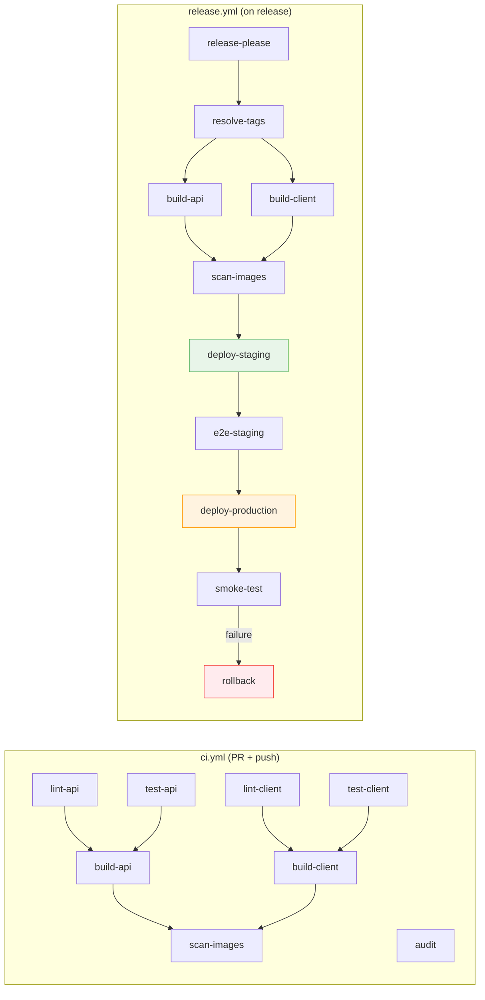

# Architecture

## System Context

## Docker Services & Networks

**Startup order:** DB → Migrations (runs to completion) → Redis → API → Client

## API Modules

## Entity Relationships

## Authentication Flow

## Assessment Workflow

**Steps:**

1. Admin creates an Implementation (DHIS2 server to certify)
2. Assessor creates a Submission against a Template
3. Assessor fills SubmissionResponses (scores each Criterion)
4. Submission finalized, scored against Template thresholds
5. If PASSED → admin issues a Certificate (W3C Verifiable Credential)

## Credential Issuance

**Public verification:** `GET /certificates/verify/:code` — no auth required. Checks: exists, not revoked, not expired, hash integrity, signature valid.

**Revocation:** BitstringStatusList (W3C standard). Each certificate gets a `statusListIndex`. Revocation flips the bit; verifiers check the published status list.

## CI/CD Pipeline

**Environment promotion:** staging (auto) → E2E gate → production (manual approval) → smoke test → auto-rollback on failure.

## API Documentation

- Swagger documentation at `http://localhost:3001/api/v1/docs`
- OpenAPI spec at `http://localhost:3001/api/v1/openapi.json`
