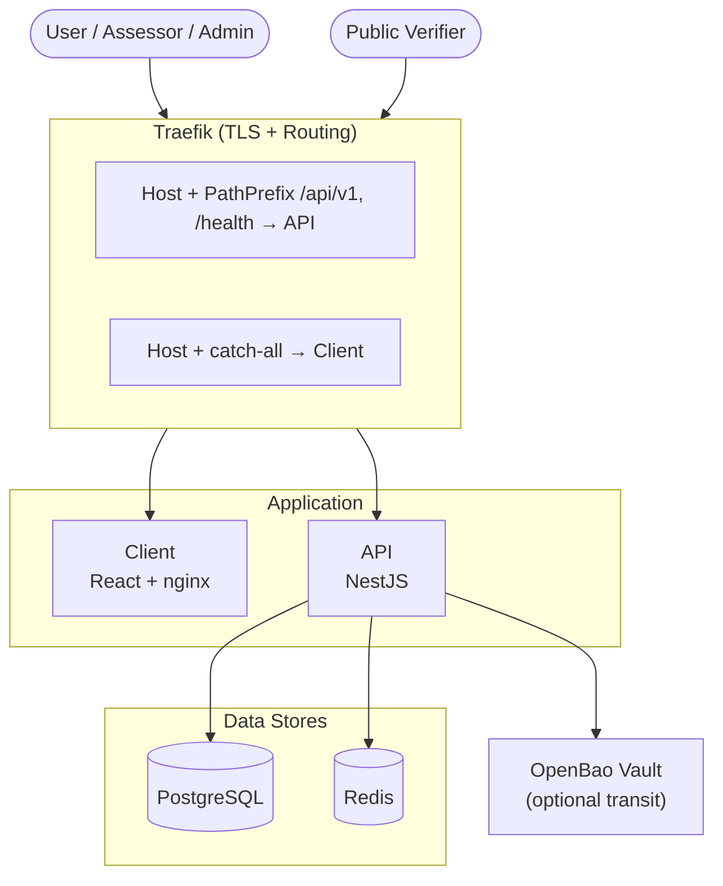
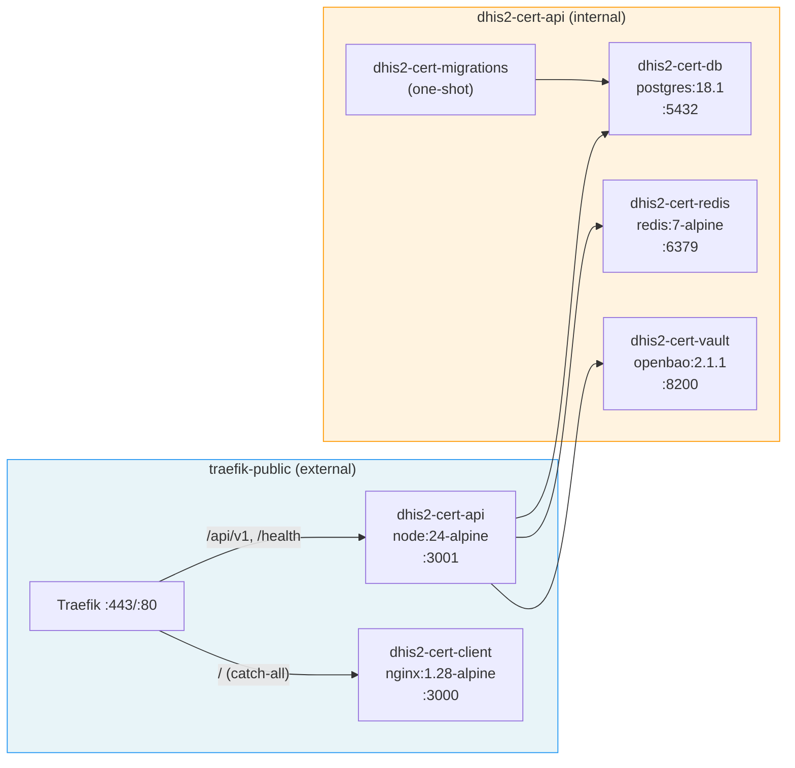
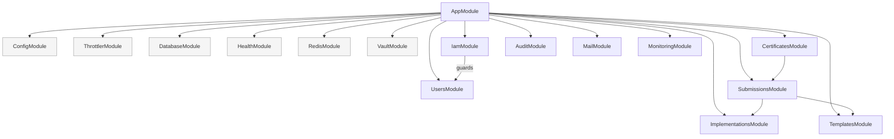
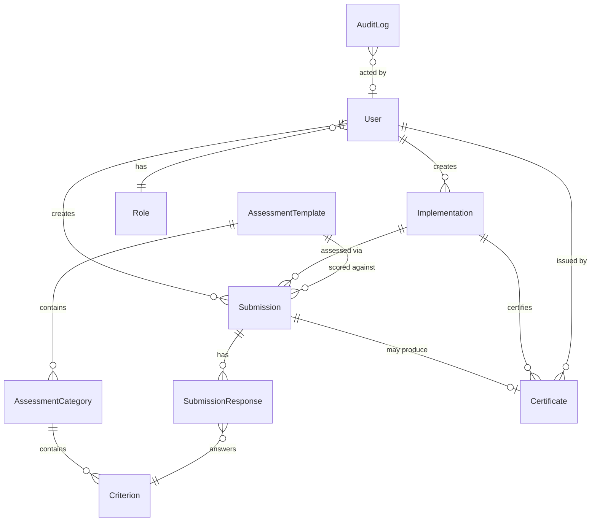
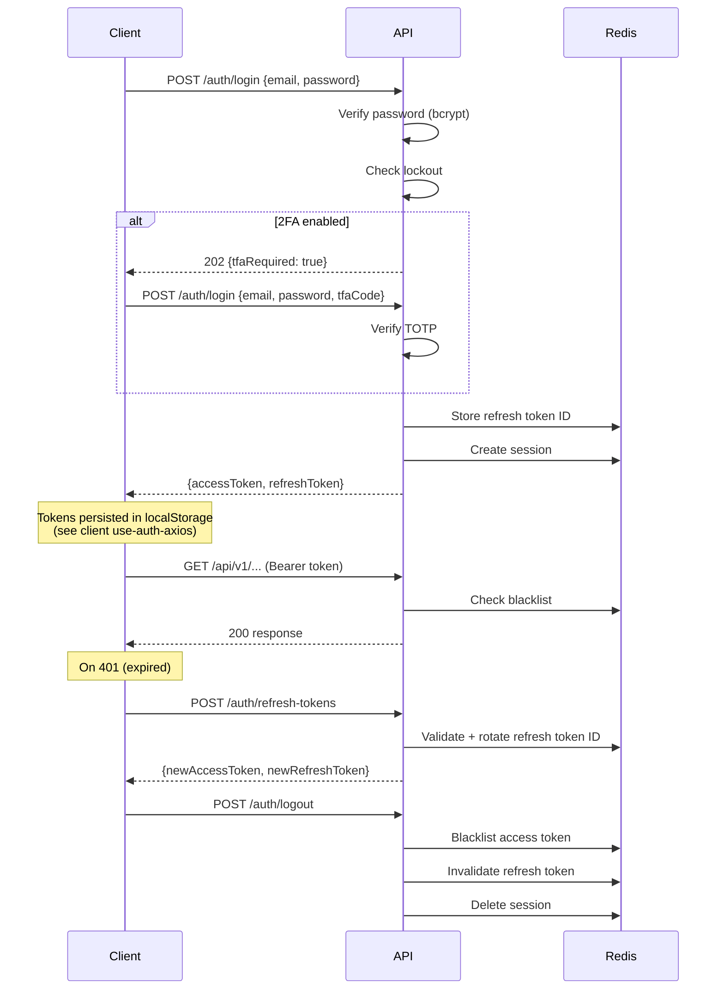
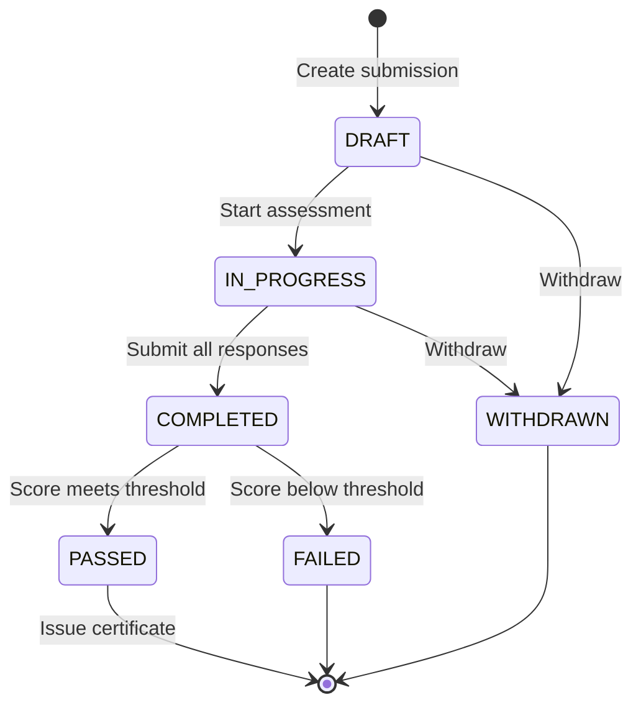
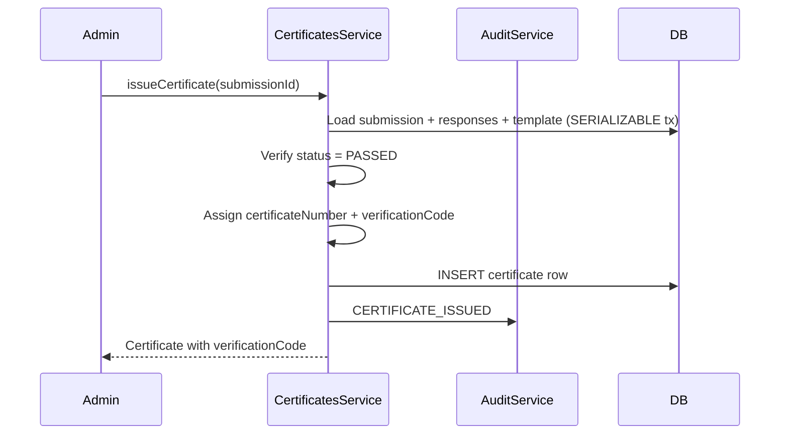
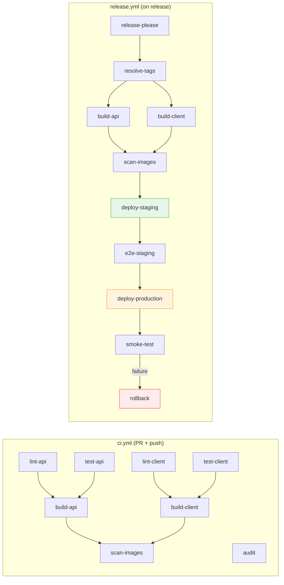

# Architecture

## Overview

The application supports **DHIS2 server and metadata certification**: assessment templates, submissions, scoring, **registry-backed certificates** (certificate number + verification code + PostgreSQL), and **public verification** without authentication.

**Stack:** React client (Vite, DHIS2 UI), NestJS API, PostgreSQL, Redis (sessions, throttling, caching), optional **OpenBao/Vault** for transit encryption used by features such as OTP.

---

## System context

```mermaid
graph TB
    User([User / Assessor / Admin])
    Public([Public Verifier])

    subgraph Traefik["Traefik (TLS + Routing)"]
        direction LR
        R1["Host + PathPrefix /api/v1, /health → API"]
        R2["Host + catch-all → Client"]
    end

    subgraph App["Application"]
        Client["Client<br/>React + nginx"]
        API["API<br/>NestJS"]
    end

    subgraph Data["Data Stores"]
        DB[(PostgreSQL)]
        Redis[(Redis)]
    end

    Vault["OpenBao Vault<br/>(optional transit)"]

    User --> Traefik
    Public --> Traefik
    Traefik --> Client
    Traefik --> API
    API --> DB
    API --> Redis
    API --> Vault
```

---

## Docker services and networks

```mermaid
graph LR
    subgraph traefik-public["traefik-public (external)"]
        Traefik["Traefik :443/:80"]
        ClientC["dhis2-cert-client<br/>nginx:1.28-alpine<br/>:3000"]
        APIC["dhis2-cert-api<br/>node:24-alpine<br/>:3001"]
    end

    subgraph dhis2-cert-api-net["dhis2-cert-api (internal)"]
        APIC
        DB["dhis2-cert-db<br/>postgres:18.1<br/>:5432"]
        RedisC["dhis2-cert-redis<br/>redis:7-alpine<br/>:6379"]
        Migrations["dhis2-cert-migrations<br/>(one-shot)"]
        VaultC["dhis2-cert-vault<br/>openbao:2.1.1<br/>:8200"]
    end

    Traefik -->|"/api/v1, /health"| APIC
    Traefik -->|"/ (catch-all)"| ClientC
    APIC --> DB
    APIC --> RedisC
    APIC --> VaultC
    Migrations --> DB

    style traefik-public fill:#e8f4f8,stroke:#2196F3
    style dhis2-cert-api-net fill:#fff3e0,stroke:#FF9800
```

**Startup order:** DB → Migrations (runs to completion) → Redis → API → Client

---

## API modules

`AppModule` wires feature modules below. There is **no** signing/VC module; `CertificatesModule` persists rows and calls `AuditService` for lifecycle events.

```mermaid
graph TD
    App[AppModule]

    App --> Config[ConfigModule]
    App --> Throttler[ThrottlerModule]
    App --> Database[DatabaseModule]
    App --> Health[HealthModule]
    App --> RedisM[RedisModule]
    App --> VaultM[VaultModule]

    App --> IAM[IamModule]
    App --> Users[UsersModule]
    App --> Impl[ImplementationsModule]
    App --> Sub[SubmissionsModule]
    App --> Tmpl[TemplatesModule]
    App --> Cert[CertificatesModule]
    App --> Audit[AuditModule]
    App --> Mail[MailModule]
    App --> Mon[MonitoringModule]

    IAM -->|guards| Users
    Sub --> Impl
    Sub --> Tmpl
    Cert --> Sub

    style Config fill:#f5f5f5,stroke:#999
    style Throttler fill:#f5f5f5,stroke:#999
    style Database fill:#f5f5f5,stroke:#999
    style Health fill:#f5f5f5,stroke:#999
    style RedisM fill:#f5f5f5,stroke:#999
    style VaultM fill:#f5f5f5,stroke:#999
```

---

## Entity relationships

```mermaid
erDiagram
    User ||--o{ Implementation : creates
    User ||--o{ Submission : creates
    User }o--|| Role : has

    Implementation ||--o{ Submission : "assessed via"
    AssessmentTemplate ||--o{ Submission : "scored against"
    AssessmentTemplate ||--o{ AssessmentCategory : contains
    AssessmentCategory ||--o{ Criterion : contains

    Submission ||--o{ SubmissionResponse : has
    Submission ||--o| Certificate : "may produce"
    SubmissionResponse }o--|| Criterion : answers

    Certificate }o--|| Implementation : "certifies"
    Certificate }o--|| User : "issued by"

    AuditLog }o--o| User : "acted by"
```

**Certificate row (conceptual):** identifiers (`certificateNumber`, `verificationCode`), validity window, revocation flags, scoring snapshot fields — no VC JSON, signature, or status-list index.

---

## Authentication flow

```mermaid
sequenceDiagram
    participant C as Client
    participant A as API
    participant R as Redis

    C->>A: POST /auth/login {email, password}
    A->>A: Verify password (bcrypt)
    A->>A: Check lockout

    alt 2FA enabled
        A-->>C: 202 {tfaRequired: true}
        C->>A: POST /auth/login {email, password, tfaCode}
        A->>A: Verify TOTP
    end

    A->>R: Store refresh token ID
    A->>R: Create session
    A-->>C: {accessToken, refreshToken}

    Note over C: Tokens persisted in localStorage<br/>(see client use-auth-axios)

    C->>A: GET /api/v1/... (Bearer token)
    A->>R: Check blacklist
    A-->>C: 200 response

    Note over C: On 401 (expired)

    C->>A: POST /auth/refresh-tokens
    A->>R: Validate + rotate refresh token ID
    A-->>C: {newAccessToken, newRefreshToken}

    C->>A: POST /auth/logout
    A->>R: Blacklist access token
    A->>R: Invalidate refresh token
    A->>R: Delete session
```

---

## Assessment workflow

```mermaid
stateDiagram-v2
    [*] --> DRAFT: Create submission

    DRAFT --> IN_PROGRESS: Start assessment
    DRAFT --> WITHDRAWN: Withdraw

    IN_PROGRESS --> COMPLETED: Submit all responses
    IN_PROGRESS --> WITHDRAWN: Withdraw

    COMPLETED --> PASSED: Score meets threshold
    COMPLETED --> FAILED: Score below threshold

    PASSED --> [*]: Issue certificate
    FAILED --> [*]
    WITHDRAWN --> [*]
```

**Steps:**

1. Admin creates an Implementation (DHIS2 server to certify).
2. Assessor creates a Submission against a Template.
3. Assessor fills `SubmissionResponse` rows (scores each Criterion).
4. Submission is finalized and scored against Template thresholds.
5. If **PASSED** → admin issues a **Certificate** (persisted in the registry with verification code; `AuditService` logs `CERTIFICATE_ISSUED`).

---

## Certificate issuance (registry-backed)

```mermaid
sequenceDiagram
    participant Admin
    participant CertSvc as CertificatesService
    participant Audit as AuditService
    participant DB

    Admin->>CertSvc: issueCertificate(submissionId)
    CertSvc->>DB: Load submission + responses + template (SERIALIZABLE tx)
    CertSvc->>CertSvc: Verify status = PASSED
    CertSvc->>CertSvc: Assign certificateNumber + verificationCode
    CertSvc->>DB: INSERT certificate row
    CertSvc->>Audit: CERTIFICATE_ISSUED
    CertSvc-->>Admin: Certificate with verificationCode
```

**Vault:** When enabled, transit APIs may be used for **encryption/signing of non-certificate payloads** (for example OTP secrets). 
---

## Audit and tamper evidence

- **`AuditLog`:** Append-only style usage with `prevHash` / `currHash` chain.
- **`AUDIT_LOG_HMAC_KEY`:** Optional HMAC over entries via `AuditIntegrityService` where configured; production should set a stable key so signatures survive restarts.
- **Admin:** `GET /api/v1/audit/validate` and `GET /api/v1/audit/integrity/validate` support bounded checks; upper bound query parameter is **`untilAuditLogId`** (not `endId`).

---

## CI/CD pipeline

```mermaid
graph LR
    subgraph CI["ci.yml (PR + push)"]
        LA[lint-api] & LC[lint-client] & TA[test-api] & TC[test-client] & AU[audit]
        LA & TA --> BA[build-api]
        LC & TC --> BC[build-client]
        BA & BC --> SC[scan-images]
    end

    subgraph Release["release.yml (on release)"]
        RP[release-please] --> RT[resolve-tags]
        RT --> BA2[build-api] & BC2[build-client]
        BA2 & BC2 --> SC2[scan-images]
        SC2 --> DS[deploy-staging]
        DS --> E2E[e2e-staging]
        E2E --> DP[deploy-production]
        DP --> SM[smoke-test]
        SM -->|failure| RB[rollback]
    end

    style DS fill:#e8f5e9,stroke:#4CAF50
    style DP fill:#fff3e0,stroke:#FF9800
    style RB fill:#ffebee,stroke:#f44336
```

**Environment promotion:** staging (auto) → E2E gate → production (manual approval) → smoke test → auto-rollback on failure. See also `deploy.yml` for path-to-production details.

---

## API documentation

- **Swagger UI** (non-production only): `http://localhost:3001/api/v1/docs` — served when `NODE_ENV !== 'production'`.
- OpenAPI document is built in-process with `SwaggerModule.createDocument`; there is **no** separate mounted `openapi.json` route in the default bootstrap — export the spec from the Swagger UI if needed, or add a small JSON endpoint in `main.ts` if the team standard requires it.
